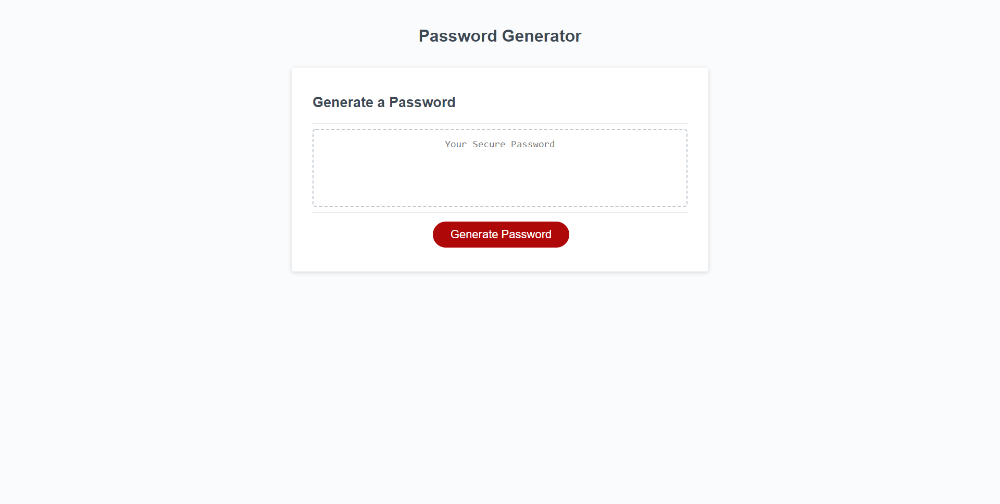

# Password-Generator

## Purpose
A webpage that generates a random password for the user based on their responses to the window prompts that appear on the screen. 

## Built With
* HTML
* CSS
* JavaScript

## Website
https://reidschroder.github.io/password-generator/

## Preview

## Contribution
Reid Schroder
